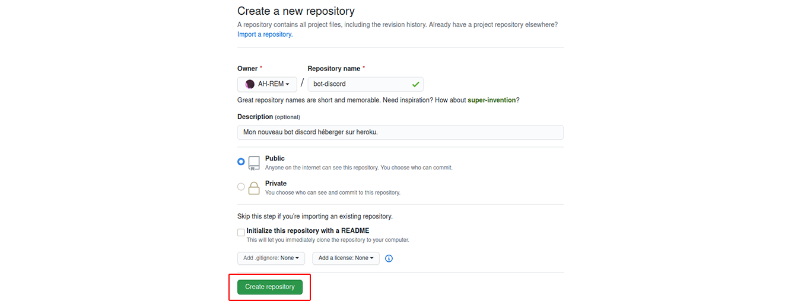
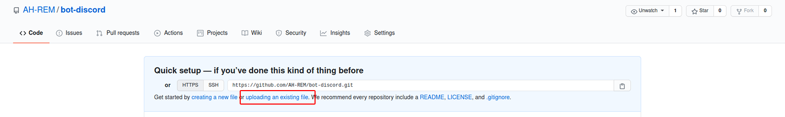
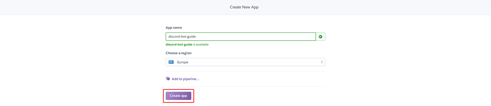
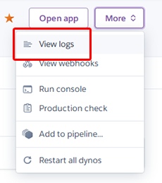
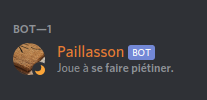

<div align="center">
    <p>
        
    </p>
</div>

## Introduction

Vous avez développé un bot discord et maintenant vous souhaitez le mettre en production ? <br />
Mais vous ne savez pas où l'héberger gratuitement ?

Ce guide est donc la solution à votre problème !
Suivez-le correctement, étape par étape et vous aurez un bot en ligne 24/7.

## Sommaire

- [Pré-requis](#pré-requis)
- [Ajouter sur GitHub](#ajouter-sur-github)
    - [Modifier le token](#modifier-le-token)
    - [Vérifier package.json](#vérifier-packagejson)
        - [Exemple](#exemple)
    - [Créer Procfile](#créer-procfile)
    - [Importer les fichiers](#importer-les-fichiers)
- [Ajouter sur Heroku](#héberger-sur-heroku)
    - [Déploiement du projet](#déploiement-du-projet)
        - [Avec GitHub](#avec-github)
    - [Ajouter le token](#ajouter-le-token)
    - [Démarrer le bot](#démarrer-le-bot)
    - [Les logs](#les-logs)
- [Conclusion](#conclusion)
- [Contribuants](#contribuants)
- [Liens](#liens)

## Pré-requis

Afin de suivre ce guide, vous devez avoir :

- un bot discord :)
- un compte [GitHub](https://github.com/)
- un compte [Heroku](https://www.heroku.com/)

## Ajouter sur GitHub

Pour commencer, créer un [nouveau dépôt](https://github.com/new) pour y mettre votre projet.



### Modifier le token

Pour une question de sécurité, ne laissez pas votre **token** directement dans votre code.
Changez donc l'argument de la méthode `login()` par `BOT_TOKEN`.

```js
client.login(process.env.BOT_TOKEN);
```

<br />
### Vérifier package.json

Si vous n'avez pas encore le fichier `package.json` dans votre projet NodeJs, il faut l'initier. <br />
Ecrivez donc la commande ci-dessous dans un terminal à la racine de votre projet.

```sh
$ npm init
```

Ensuite vérifier dans celui-ci que vous avez bien les bonnes dépendances nécessaires, ainsi que leur version.

#### Exemple

```json
{
  "name": "paillasson",
  "version": "1.0.0",
  "main": "index.js",
  "scripts": {
    "start": "node index.js"
  },
  "author": "AH_REM",
  "dependencies": {
      "discord.js": "^12.1.1",
  }
}
```

Fichier `package.json` du bot [Paillasson](https://github.com/AH-REM/Paillasson).

<br />
### Créer Procfile

Créer un fichier avec le nom *Procfile* sans extension et ajoutez y la ligne ci-dessous. <br />
Ce sera le script utilisé pour démarrer votre bot.

Si votre fichier principal n'est pas `index.js` changez le nom.

```
Worker: node index.js
```

<br />
### Importer les fichiers

Vous pouvez donc maintenant ajouter tous vos fichiers du bot dans le dépôt.



> Note: N'importez pas le fichier `package-lock.json` et le dossier `node_modules` sur GitHub.

<br />
## Héberger sur Heroku

Pour commencer créer une [nouvelle application](https://dashboard.heroku.com/new-app) pour héberger votre bot.



### Déploiement du projet

Dans la section *Deploy*, plusieurs méthodes sont disponibles pour déployer votre projet sur Heroku.


#### Avec GitHub

Connectez-vous à [GitHub](https://github.com/) et choisissez votre projet.


Après, appuyez sur le bouton `Enable Automatic Deploys`, ainsi à chaque fois que votre projet sera modifié sur GitHub, il le sera aussi sur Heroku et le bot redémarra automatiquement.

> Note: Si vous voulez faire le déploiement manuellement à chaque modification, vous pouvez le faire en bas de page.

<br />
### Ajouter le token

Rendez-vous dans *Settings*, au niveau des configurations de variables et ajoutez en une nouvelle, `BOT_TOKEN` avec en paramètre le token de votre bot.


### Démarrer le bot

Rendez-vous dans *Ressources*, désactivez `web` et activez `Worker` pour démarrer le bot. <br />
Vous pouvez ainsi l'éteindre en désactivant celui-ci.


### Les logs

Vous pouvez accéder aux logs du bot en appuyant sur le bouton *More* en haut à droite et *View logs*.



## Conclusion

Votre bot est maintenant **opérationnel** !



> Note: Dans le cas contraire, reprenez depuis le début la procédure. Cependant, si cela persiste n'hésitez à nous faire parvenir le problème.

Avec l'offre gratuite de Heroku, vous disposerez donc d'assez de crédit pour héberger un bot 24/7.
Celui-ci redémarra une fois par jour automatiquement.

En vous remerciant d'avoir suivi ce guide.

## Contribuants

<a href="https://github.com/AH-REM">
    
</a>

## Liens

- [Guide](https://ah-rem.github.io/heroku-guide/) [(source)](https://github.com/AH-REM/heroku-guide)
- [Zone Dev - Serveur discord](https://discord.gg/Hzwjk4M)

### Sources

- [https://medium.com/@mason.spr/](https://medium.com/@mason.spr/hosting-a-discord-js-bot-for-free-using-heroku-564c3da2d23f)
